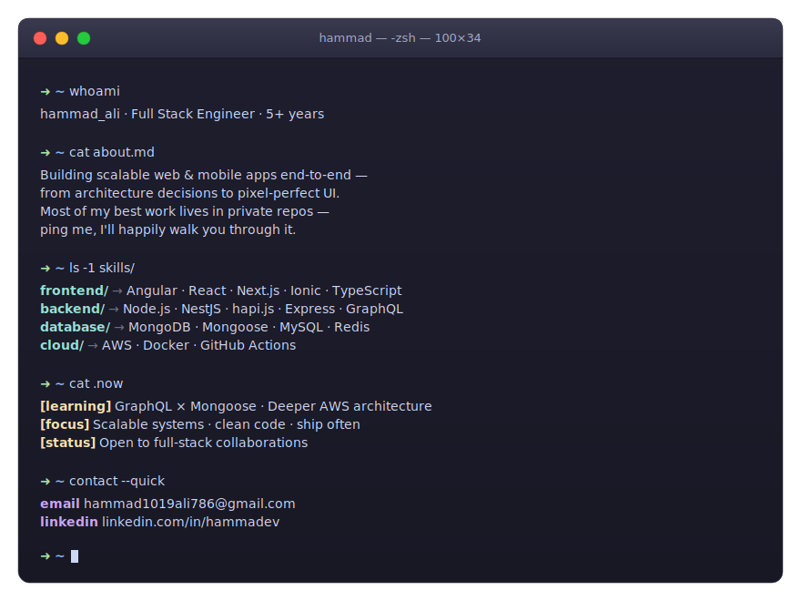

<!-- =====================================================
     HAMMAD ALI · GITHUB PROFILE
     ===================================================== -->

<!-- ANIMATED HEADER -->

  
   
  

---

<!-- WHOAMI — PREMIUM macOS TERMINAL -->
## 🧠  whoami

  

 

<!-- TECH ARSENAL -->
## ⚡  Tech Arsenal

  
   
  
   
  

 

<!-- STATS -->
## 📊  By the Numbers

  

 

<!-- CONNECT -->
## 🤝  Let's Connect

  
  
  

   
  <i>Thanks for stopping by — let's build something cool. ✨</i>

